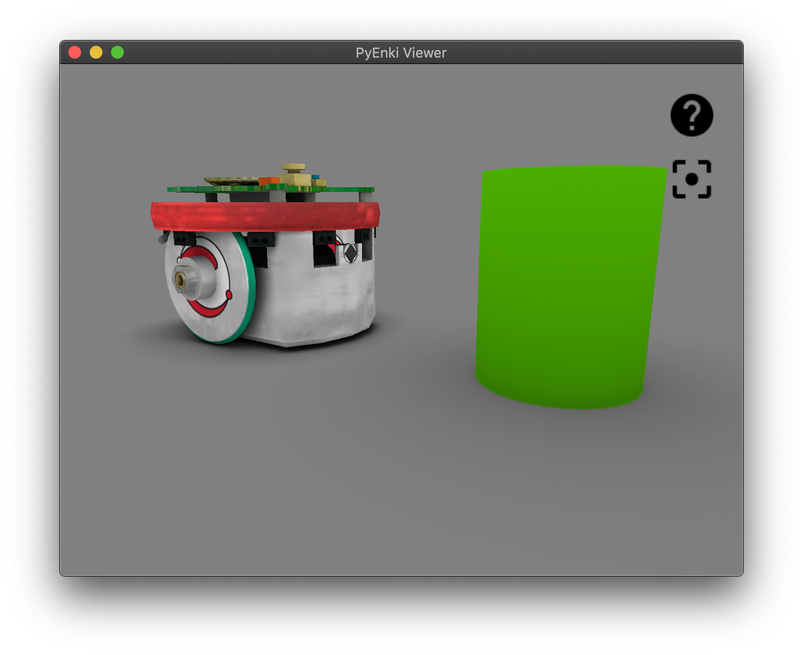

Examples
========

Basic Examples
--------------

These three examples show how to create a world, add robots and objects, read sensors and perform actions.

E-puck
~~~~~~~

.. code-block:: Python

    >>> import pyenki
    >>> world = pyenki.World()
    >>> epuck = pyenki.EPuck()
    >>> world.add_object(epuck)
    >>> epuck.position = (-10, 0)
    >>> epuck.set_led_ring(True)
    >>> world.add_object(pyenki.CircularObject(2.0, 5.0, -1, pyenki.Color(0.3, 0.7, 0)))
    >>> world.step(0.1)
    >>> epuck.prox_values
    [104.60820372038921, ...
    >>> epuck.camera_image
    [(0.5, 0.5, 0.5), ...

Marxbot
~~~~~~~~

.. code-block:: Python

    >>> import pyenki
    >>> # create a world surrounded by a cylindrical wall.
    >>> world = pyenki.World(r=20.0, walls_color=pyenki.Color(0.8, 0.2, 0.1))
    >>> marxbot = pyenki.Marxbot()
    >>> world.add_object(marxbot)
    >>> marxbot.position = (0.0, 0.0)
    >>> marxbot.angle = 0.0
    >>> # Spin the robot on itself
    >>> marxbot.left_wheel_target_speed = 5.0
    >>> marxbot.right_wheel_target_speed = -5.0
    >>> # Read the omnidirectional rgb-d camera
    >>> # Distances
    >>> marxbot.scanner_distances
    [19.68757743875876, ...
    >>> # Image
    >>> marxbot.scanner_image
    [[(0.8, 0.2, 0.1), ...

.. image:: images/marxbot.png
  :width: 400

Thymio
~~~~~~~

.. code-block:: Python

    >>> import pyenki
    >>> world = pyenki.World()
    >>> thymio = pyenki.Thymio2(use_aseba_units=False)
    >>> world.add_object(thymio)
    >>> thymio.position = (14.1, 7.2)
    >>> thymio.angle = 4.0
    >>> # Spin the robot on itself
    >>> thymio.motor_left_target = 10.2
    >>> thymio.motor_right_target = -10.2
    >>> # Switch the top LED yellow
    >>> thymio.set_led_top(0.5, 0.5, 0.0)
    >>> world.add_object(pyenki.RectangularObject(5.0, 5.0, 5.0, -1, pyenki.Color(0.8, 0.3, 0)))
    >>> world.step(0.1)
    >>> thymio.prox_values
    [0.0, 0.0, 0.0, 3043.220367053277, 0.0, 0.0, 0.0]

.. image:: images/thymio.png
  :width: 400

Objects
~~~~~~~~

.. code-block:: Python

    >>> import pyenki
    >>> world = pyenki.World()
    >>>
    >>> c = pyenki.CompositeObject(
    >>>     [
    >>>         ([(0, 1), (0, 0.5), (2, 0.5), (2, 1)], 1.0),
    >>>          ([(0, -0.5), (0, -1), (2, -1), (2, -0.5)], 1.0),
    >>>          ([(0, 0.5), (0, -0.5), (0.5, -0.5), (0.5, 0.5)], 1.0)
    >>>     ],
    >>>     -1, color=pyenki.Color(0, 0.5, 0.5))
    >>> world.add_object(c)
    >>>
    >>> triangle = pyenki.ConvexObject(
    >>>         [(0.0, 0.0), (1.0, -1.0), (1.0, 1.0)],
    >>>         1, -1, color=pyenki.Color(0.5, 0.5, 0.0))
    >>> triangle.position = (5, 0)
    >>> world.add_object(triangle)
    >>>
    >>> cylinder = pyenki.CircularObject(1.0, 1.0, -1, color=pyenki.Color(0.5, 0.0, 0.5))
    >>> cylinder.position = (10, 0)
    >>> world.add_object(cylinder)
    >>>
    >>> box = pyenki.RectangularObject(2.0, 1.0, 1.0, -1, color=pyenki.Color(0.2, 0.5, 0.7))
    >>> box.position = (15, 0)
    >>> world.add_object(box)

    >>> # at the moment textures are used to compute the sensors (cameras) response
    >>> # but are ignored when displaying the object
    >>> colorful_box_shape = [(0.0, 0.0), (1.0, 0.0), (1.0, 1.0), (0.0, 1.0)]
    >>> colorful_box_colors = [pyenki.Color.red, pyenki.Color(0.5, 0.5, 0.0),
                               pyenki.Color.green, pyenki.Color(0.0, 0.5, 0.5)]
    >>> colorful_box = pyenki.ConvexObject(colorful_box_shape, 1, -1, side_color=colorful_box_colors)
    >>> colorful_box.position = (20, 0)
    >>> world.add_object(colorful_box)

.. image:: images/objects.png
  :width: 400

Hello Thymio
------------

In the most common case, you want to subclass one or more robots adding the appropriate controller.
Then, you setup up the world, adding as many objects as needed.
Finally, you may either run the simulation in real time inside a Qt application,
or write your own loop where to call ``World.step``.

In this example, a Thymio will advance as long as there is not a obstacle (a wall) in front of it,
when it will stop and switch the LED color to red from green.

  .. include:: ../../example/hello_thymio.py
    :code: Python

Proximity Communication
-----------------------

In this example, two Thymios placed in front of each other, transmit messages using proximity communication.
After each control step, we print the received messages.

.. include:: ../../example/two_thymios_comm.py
  :code: Python

Interactive GUI
---------------

The QWidget that display the world can be run either two modes:
- embedded in a standalone QtApplication, like in :ref:`Hello Thymio`, that blocks until it terminates
- or using an already running QtApplication, which does not block and allow to visualize the world
while manipulating it in an interactive session (e.g., in a jupyter notebook or console)

For instance, this script

.. include:: ../../example/interactive_view.py
  :code: Python

will spawn a live world view when run inside an jupyter console

.. code-block:: Bash

  $ jupyter console
  >>> %gui qt5
  >>> %run interactive_view.py
